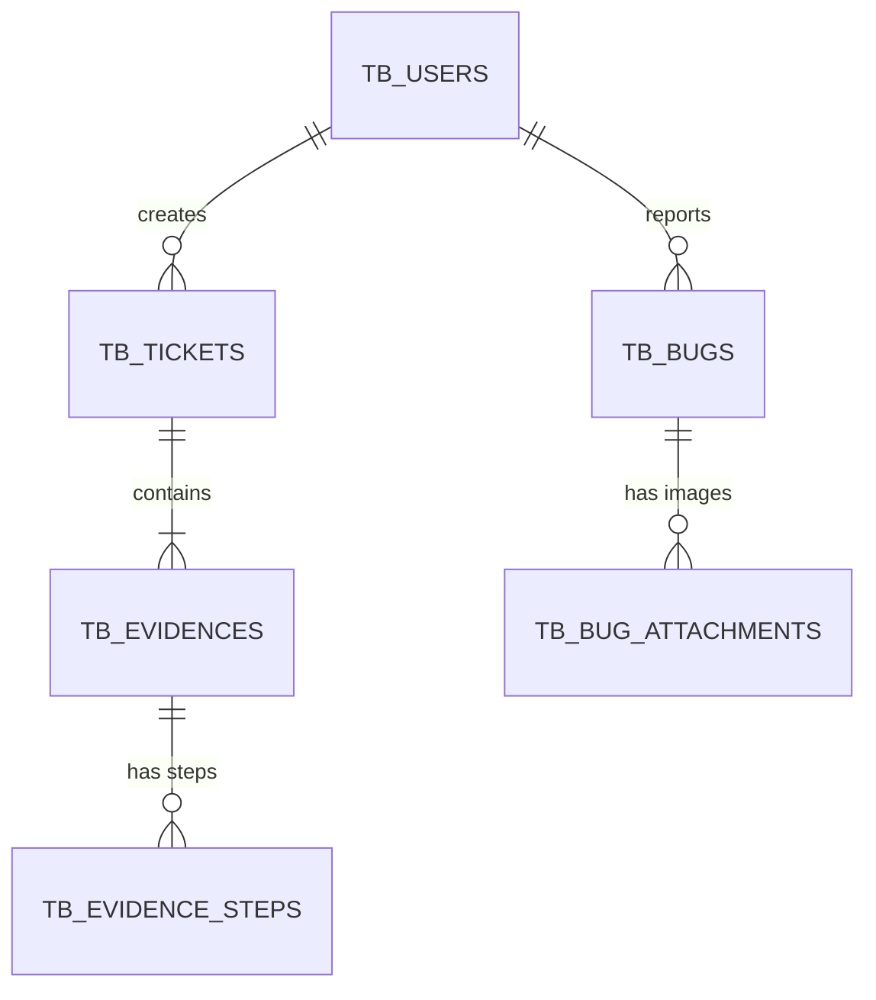

# Documentação do Banco de Dados - QA Evidence System

Esta documentação descreve a estrutura de dados projetada para Oracle Database 11g.

## 1. Diagrama Entidade-Relacionamento (Conceitual)



## 2. Dicionário de Dados

### `TB_USERS`
Armazena os usuários do sistema e suas credenciais.
*   **ID_USER**: Identificador único (UUID).
*   **ACRONYM**: Sigla de 3 letras (Login), chave natural e única.
*   **ROLE**: Permissão ('ADMIN' ou 'USER').
*   **IS_ACTIVE**: Controle lógico de exclusão (1=Ativo).

### `TB_TICKETS`
Cabeçalho de um conjunto de testes/evidências (o "Chamado").
*   **ID_TICKET**: UUID.
*   **EXTERNAL_TICKET_ID**: ID externo para referência (ex: Jira, Redmine).
*   **CREATED_BY**: Relaciona com a sigla do usuário (`TB_USERS.ACRONYM`).
*   **PRIORITY**: 'Baixa', 'Média', 'Alta'.

### `TB_EVIDENCES`
Representa um Cenário de Teste completo ou uma Evidência Manual.
*   **STATUS**: 'PASS', 'FAIL', 'BLOCKED', 'PENDING'.
*   **CASE_ID_DISPLAY**: ID amigável gerado pelo front (ex: QA-55432).
*   **FAILURE_REASON**: Texto explicativo caso STATUS seja FAIL ou BLOCKED.

### `TB_EVIDENCE_STEPS`
Passos individuais de um caso de teste complexo (Wizard).
*   **IMAGE_DATA**: Imagem em Base64 armazenada como `CLOB`.
*   **ID_STEP**: Gerado automaticamente via Sequence/Trigger.

### `TB_BUGS`
Módulo independente para reporte de erros.
*   **STATUS**: Workflow do bug ('Pendente', 'Em teste', 'Descartado', etc.).
*   **ENVIRONMENT**: Lista de ambientes (armazenado como string separada por vírgula).

## 3. Regras de Implementação Oracle 11g

1.  **UUIDs**: Como o Oracle 11g não possui tipo nativo UUID, utilizamos `VARCHAR2(36)` para armazenar as strings geradas pela aplicação React (`crypto.randomUUID()`).
2.  **Imagens**: Armazenadas como `CLOB` (Character Large Object) pois a aplicação envia strings Base64 (`data:image/png;base64,...`).
3.  **Auto Incremento**: Implementado via par `SEQUENCE` + `TRIGGER` (`BEFORE INSERT`), padrão da versão 11g.
4.  **Integridade**: `ON DELETE CASCADE` configurado nas tabelas filhas. Se um Chamado ou Bug for excluído, todos os seus anexos e passos são removidos automaticamente.

## 4. Exemplos de Consultas (Queries)

### Listar Bugs Pendentes
```sql
SELECT SUMMARY, PRIORITY, ANALYST_NAME 
FROM TB_BUGS 
WHERE STATUS = 'Pendente' 
ORDER BY CREATED_AT DESC;
```

### Métricas de Produtividade (Dashboard)
```sql
SELECT CREATED_BY, COUNT(*) as TOTAL_CHAMADOS
FROM TB_TICKETS
GROUP BY CREATED_BY;
```

### Recuperar Evidência Completa
```sql
SELECT T.TITLE as CHAMADO, E.TITLE as CENARIO, E.STATUS
FROM TB_TICKETS T
JOIN TB_EVIDENCES E ON T.ID_TICKET = E.ID_TICKET
WHERE T.EXTERNAL_TICKET_ID = '58645';
```
